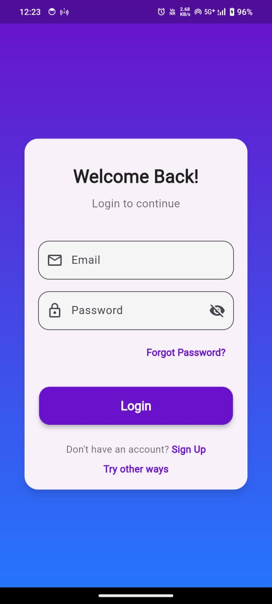
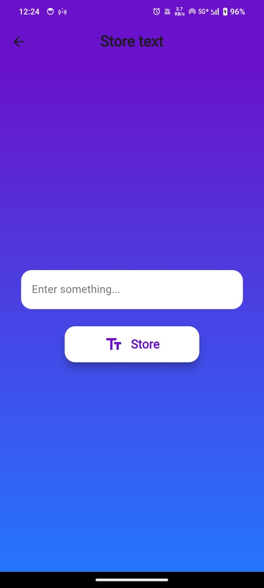

This is a Flutter app integrated with Firebase Authentication for secure user authentication, including Email/Password login, Phone Number login (OTP-based), and Google Sign-In. The app also allows users to upload data using Firestore for persistent storage.

<h1>Outputs</h1>

